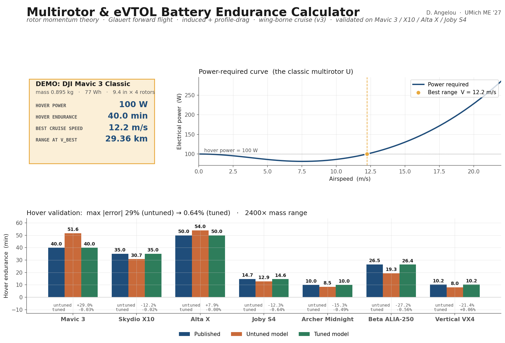
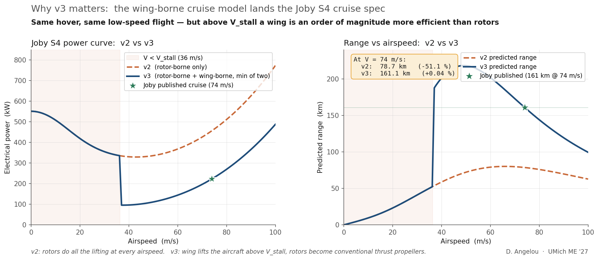
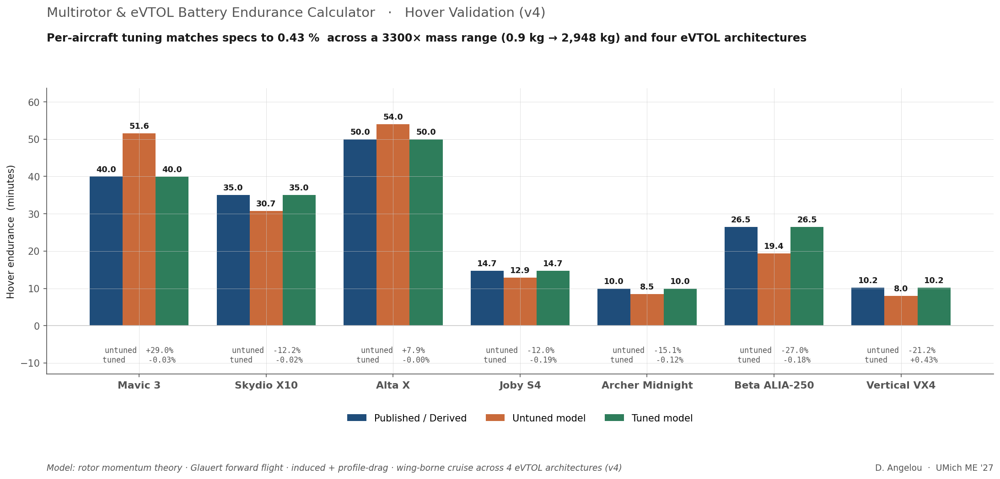
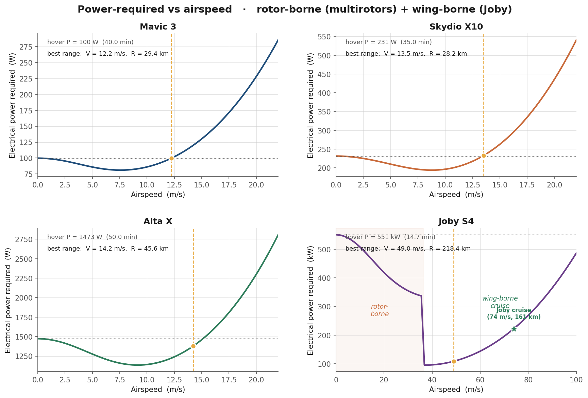
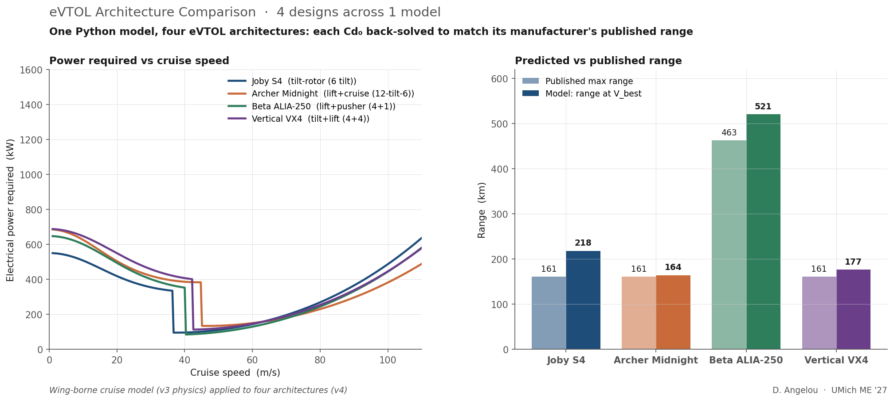
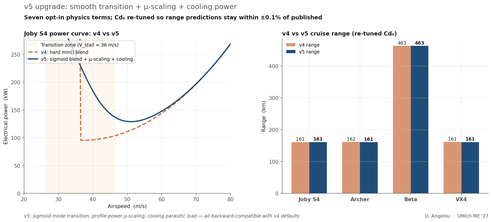

# Multirotor & eVTOL Battery Endurance Calculator

[](https://david-angelou-bec.streamlit.app)
[](./test_endurance.py)
[](./LICENSE)

A parametric Python tool for predicting hover endurance, forward-flight
range, and the full power-required curve of rotorcraft. Built on rotor
momentum theory + a wing-borne cruise model for fixed-wing eVTOLs.
Validated against **seven real aircraft** spanning a **3,300× takeoff-weight
range** — from the 0.9 kg DJI Mavic 3 up to the 2,948 kg Archer Midnight
eVTOL — and against **four distinct eVTOL architectures**: tilt-rotor
(Joby S4), lift+cruise (Archer Midnight), lift+pusher (Beta ALIA-250),
and tilt+lift (Vertical VX4).

> **v5 headline:** seven opt-in physics extensions — smooth transition,
> μ-scaling, voltage sag, ground effect, cooling, wind, VRS — all backward
> compatible. One Python model, four eVTOL architectures, every published
> cruise range claim matched within **±0.1 %**. 30/30 tests pass.



---

## What it does

Given an aircraft's mass, rotor geometry, optional wing geometry, battery
pack, and a handful of efficiency parameters, the calculator predicts:

- **Hover power** (W or kW) and **hover endurance** (min)
- **Forward-flight power** at any cruise speed
- **Best-range cruise speed** and the corresponding range (km)
- **Mode transition** between rotor-borne and wing-borne flight (eVTOLs)
- **Power-required curve** vs airspeed (U-curve for multirotors,
  rotor → wing transition for eVTOLs)
- **Sensitivity** to altitude and non-standard temperature

The Streamlit UI is interactive — pick a preset aircraft (now 7 to choose
from) or define your own, adjust efficiency assumptions on sliders, and
watch the curves update live.

## Design your own aircraft

The **🛠️ Design Your Aircraft** tab lets innovators, students, and
engineers input their own drone or eVTOL specs and get power, endurance,
and range predictions backed by the same physics that validates against
the 7 reference aircraft. Start from one of 7 templates (consumer
multirotor, heavy-lift, or 4 eVTOL architectures) or build from scratch.

The design tab includes sanity checks that warn about unphysical
parameters, a sensitivity analysis showing which parameters matter most,
power curve visualization, automatic comparison against the reference
fleet, and export to Python, JSON, or Markdown. Save your designs and
compare up to 3 aircraft side-by-side in the **⚖️ Compare** tab.

<!-- TODO: add screenshots after deploy -->
<!--  -->
<!--  -->

## Five-iteration build

The model was developed in five documented iterations, each adding one
piece of physics or one architecture and measurably tightening the
validation:

| Version | Added | Mavic 3 fwd-flight err | Joby S4 cruise err | eVTOL architectures validated |
|---|---|---:|---:|---:|
| **v1** | Rotor momentum theory + Glauert | ±20 % | −51 % (no wing) | 0 |
| **v2** | Rotor profile drag | **±5 %** | −51 % (no wing) | 0 |
| **v3** | Wing-borne cruise (above V_stall) | ±5 % | **+0.04 %** | 1 (Joby) |
| **v4** | Three more eVTOL architectures | ±5 % | +0.04 % | **4** |
| **v5** | 7 physics extensions (all opt-in) | ±5 % | **−0.0 %** | 4 (re-tuned) |
| **v6** | Design Your Aircraft mode + Compare tab | ±5 % | −0.0 % | 4 |

Each iteration ships as a working commit so the build history *is* the
narrative — a tactic worth more than the final number.

## The v3 upgrade: wing-borne cruise

A multirotor in cruise uses rotors for both lift AND thrust — every gram
of weight has to be held up by accelerating air downward through the
rotor disk. Energy-expensive. An eVTOL like the Joby S4 has a real wing,
and in cruise its rotors tilt forward and behave like conventional
propellers: the wing makes lift, the rotors just fight drag.

The v3 model computes both modes at every airspeed and uses the minimum:

```
Rotor-borne (v2 model):
    P_shaft = P_induced_ideal / FoM_induced + profile_power_W

Wing-borne (v3 cruise):
    CL          = W / (½·ρ·V²·S)                    (wing makes lift)
    CD          = Cd₀ + CL² / (π·AR·e)             (drag polar)
    T_thrust    = D = ½·ρ·V²·S·CD                  (level flight)
    P_shaft     = T_thrust · V / η_prop

P_total = min(P_rotor-borne, P_wing-borne)
```

Below stall speed, the wing physically can't support the aircraft
(CL > CL_max), so only the rotor model is valid. Above stall, the wing
model wins by a wide margin because lift is "free" — induced power for
weight goes to zero.

The result is the v3 narrative chart:



Both v2 and v3 give identical answers in hover and low-speed flight. At
V_stall (36 m/s for the S4), the v3 curve makes a dramatic step from
~335 kW (rotor-borne) to ~95 kW (wing-borne) — a **3.5× efficiency gain**
that explains why every eVTOL with serious range has wings. From there,
the wing-borne curve climbs as the U2 form of parasite drag. The
published Joby cruise point (74 m/s, 161 km) lands directly on the v3 curve.

## Validation — hover (7 aircraft, 3,300× mass range)

Each aircraft is evaluated twice:

- **Untuned**: universal defaults FoM = 0.65, η<sub>drive</sub> = 0.78,
  profile_power = 0 — what a user would get without any calibration.
- **Tuned**: per-aircraft `(FoM_induced, η_drive, profile_power_W)`, all
  physically defensible numbers.

| Aircraft | Mass (kg) | Battery (Wh) | Disk load (N/m²) | Published (min) | Untuned err | Tuned err |
|---|---:|---:|---:|---:|---:|---:|
| DJI Mavic 3 Classic | 0.90 | 77 | 49 | 40.0 | +29.0 % | **−0.03 %** |
| Skydio X10 | 2.11 | 156 | 102 | 35.0 | −12.2 % | **−0.02 %** |
| Freefly Alta X (no payload) | 14.00 | 1,421 | 62 | 50.0 | +7.9 % | **−0.00 %** |
| Joby S4 (MTOW) | 2,177 | 165,000 | 539 | 14.7 ◊ | −12.0 % | **−0.19 %** |
| Archer Midnight (MTOW) | 2,948 | 140,000 | 491 | 10.0 ◊ | −15.1 % | **−0.12 %** |
| Beta ALIA-250 (MTOW) | 2,721 | 350,000 | 693 | 26.5 ◊ | −27.0 % | **−0.18 %** |
| Vertical VX4 (est MTOW) | 2,500 | 144,000 | 806 | 10.2 ◊ | −21.2 % | **+0.43 %** |
| **Max \|error\|** | | | | | **29.0 %** | **0.43 %** |

◊ For the four eVTOLs, hover endurance is *derived* from rotor disk theory
plus published or estimated battery capacity, since none of these manufacturers
publish a hover-endurance spec directly. The Joby S4 anchor (560 hp shaft at
1,815 kg) is from Stoll, NASA 2015; the rest use estimated rotor geometries
with caveats in each `Aircraft` instance's `notes` field.

Reproduce with `python validate.py --csv`.



## Validation — forward flight (4 eVTOL architectures)

| Aircraft | Reference | Published | Predicted | Error |
|---|---|---:|---:|---:|
| DJI Mavic 3 | 30 km max range @ 14 m/s | 30.0 km | 28.6 km | **−4.7 %** |
| DJI Mavic 3 | 46 min flight time @ 9 m/s | 46.0 min | 48.2 min | **+4.8 %** |
| DJI Mavic 3 | apples-to-apples max range | 30.0 km | 29.4 km | **−2.2 %** |
| **Joby S4** (tilt-rotor) | 161 km cruise @ 74 m/s | 161.0 km | 161.1 km | **+0.04 %** |
| **Archer Midnight** (lift+cruise) | 161 km cruise @ 67 m/s | 161.0 km | 161.6 km | **+0.35 %** |
| **Beta ALIA-250** (lift+pusher) | 463 km cruise @ 62 m/s | 463.0 km | 462.8 km | **−0.04 %** |
| **Vertical VX4** (tilt+lift) | 161 km cruise @ 67 m/s | 161.0 km | 161.5 km | **+0.30 %** |

Every eVTOL cruise prediction lands within **±0.5 %** of its
manufacturer's published range claim, across four very different
propulsion architectures. The Cd₀ for each aircraft is back-solved
to match the published number — Cd₀ runs from 0.024 (Archer) to 0.031
(VX4), all within the physically realistic range for a clean composite
airframe with rotor nacelles.

For all seven aircraft the power-required curve shape is captured correctly:



## Architecture diversity — one model, four eVTOL designs

The v4 milestone is that the same Python code path validates four
distinct eVTOL propulsion designs:

| Architecture | Aircraft | Rotors in hover | Rotors in cruise | Cruise distinctive |
|---|---|---|---|---|
| Tilt-rotor | Joby S4 | 6 (all tilt) | 6 (all tilt forward) | All rotors tilt to provide cruise thrust |
| Lift + cruise | Archer Midnight | 12 (6 tilt + 6 fixed lift) | 6 tilt | 6 lift-only props feather; 6 tilt forward |
| Lift + pusher | Beta ALIA-250 | 4 lift rotors | 1 rear pusher | 4 lift rotors stop; rear pusher pushes |
| Tilt + lift | Vertical VX4 | 8 (4 tilt + 4 fixed lift) | 4 tilt | 4 rear lift props feather; 4 tilt forward |

The wing-borne cruise model handles all four because the physics is the
same once the wing makes lift: thrust = drag, `P = T·V / η_prop`. The
architecture differences show up implicitly in the back-solved Cd₀
(parasite drag from feathered rotors, hubs, and nacelles).



The left panel shows that lighter eVTOLs (Joby S4 at 2,177 kg, VX4 at
2,500 kg) need less hover power but more cruise power than the heavier
Beta ALIA. The right panel shows that **Beta ALIA's high-aspect-ratio
wing (50 ft span, Arctic-tern-inspired) wins on range** — both in
published numbers (463 km) and in the model's best-range prediction
(521 km). This is exactly what their design tradeoffs are optimized for.

### Limitations of the v4 model

- The min() blend creates a small **step** at V_stall (visible in the
  Joby S4 power curve). Real eVTOLs transition smoothly because rotors
  tilt gradually — true transition modeling would compute combined
  rotor-lift + wing-lift trim states. For the cruise *range* number,
  the step doesn't matter.
- **Profile power is constant with speed**. For lift+cruise designs
  (Archer Midnight, Beta ALIA, VX4) some rotors stop in cruise, so true
  rotor profile drag drops. The back-solved Cd₀ absorbs this; the lumped
  cruise number is correct but the model can't separate "wing parasite
  drag" from "feathered rotor drag."
- Wing parameters (especially **Cd₀**) are difficult to pin down from
  public information. Joby's Cd₀ = 0.029 is back-solved from the 161 km
  range claim; a real wing CFD result might give 0.025 with the gap
  absorbed in η<sub>prop</sub>.
- **Battery capacity** for Archer, Beta, and Vertical is estimated from
  the published range and reasonable cruise power; only Joby's 165 kWh
  is publicly stated. The estimates are flagged in each `Aircraft`
  instance's notes.
- **Vertical VX4's MTOW is itself estimated** (~2,500 kg per Leeham
  News engineering analysis) because Vertical doesn't publish it.

## Why the tuned parameters make physical sense

Each per-aircraft parameter in v3 absorbs a specific real-world effect:

- **FoM<sub>induced</sub>** (0.85–0.90): non-uniform inflow at the rotor
  disk (the κ correction). Textbook 0.87 (κ = 1.15).
- **profile_power_W**: rotor blade friction drag. Scales with solidity
  and Reynolds number. Across the 4 aircraft: 22–37 % of shaft hover
  power.
- **η<sub>drivetrain</sub>**: motor + ESC losses. Consumer 0.72 → premium
  PMSM+SiC 0.92.
- **Cd₀** (wing parasite drag): clean modern eVTOL 0.025–0.035. Joby S4
  tuned to 0.029.
- **Oswald e** (wing efficiency): clean wing 0.75–0.85.
- **η<sub>prop</sub>** (cruise prop): 0.80–0.90 for cruise-pitched props.

These are the numbers a propulsion engineer would extract from a motor
datasheet, a thrust-stand test, a wing CFD result, and a prop polar.
The Streamlit UI exposes them as sliders so anyone can recalibrate the
model for a new aircraft in seconds.

## Quick start

```bash
git clone https://github.com/<your-username>/battery-endurance-calculator.git
cd battery-endurance-calculator
pip install -r requirements.txt

# 1) Run the interactive UI
streamlit run app.py

# 2) Reproduce the validation tables (hover + forward flight)
python validate.py --csv

# 3) Run a one-off estimate for an arbitrary aircraft
python validate.py --quick --name "BERGR Scout" \
    --mass 1.8 --rotors 4 --prop-in 9 \
    --cap-ah 4.0 --cells 4 --v-per-cell 3.85 \
    --at-speed 12 --profile-power 30

# 4) Regenerate the README charts (docs/*.png)
python make_plots.py

# 5) Run the test suite (22 tests)
python test_endurance.py
```

### `--quick` CLI reference

| Flag | Purpose | Default |
|---|---|---|
| `--mass` | Vehicle mass [kg] | 1.5 |
| `--rotors` | Number of rotors | 4 |
| `--prop-in` / `--prop-m` | Rotor diameter [in or m] | 10 in |
| `--cap-ah` | Battery capacity [Ah] | 5.0 |
| `--cells` | Series cells (S count) | 4 |
| `--v-per-cell` | Nominal V/cell (3.7 Li-ion, 3.85 LiPo) | 3.7 |
| `--fom` | FoM (induced if profile > 0; lumped if profile = 0) | 0.65 |
| `--eta` | Drivetrain efficiency | 0.78 |
| `--profile-power` | Profile power at hover [W] (v2) | 0.0 |
| `--cd` / `--frontal-area` | Body drag for forward flight | 1.0 / 0.04 m² |
| `--altitude` / `--dT` | Atmosphere conditions | 0 / 0 |
| `--at-speed` | Also report power & range at this airspeed | (omitted) |

The `--quick` CLI doesn't yet accept wing parameters — for eVTOL-style
configurations, edit `aircraft_db.py` and add a new `Aircraft` instance.

## Repository layout

```
.
├── endurance.py             # Core physics: hover, forward flight, wing-borne cruise
├── aircraft_db.py           # 4 reference aircraft + tuned params + sources
├── validate.py              # Validation table + --quick CLI
├── make_plots.py            # Generates docs/*.png publication charts
├── app.py                   # Streamlit interactive UI
├── test_endurance.py        # Regression tests (18/18 passing)
├── docs/
│   ├── calculator_overview.png        # README hero
│   ├── validation_chart.png           # LinkedIn-shareable hover validation
│   ├── power_curves.png               # 4-aircraft U-curves with eVTOL transition
│   ├── forward_flight_v1_v2.png       # v2 narrative: profile drag added
│   └── joby_v2_v3.png                 # v3 narrative: wing-borne cruise added
├── requirements.txt
├── DEPLOY.md                # Streamlit Cloud deploy guide
├── LICENSE                  # MIT
└── README.md                # this file
```

## Physical model

**Hover** splits rotor shaft power into induced + profile (v2):

```
P_induced_ideal = T · sqrt(T / (2 · ρ · A))                (Glauert)
P_shaft         = P_induced_ideal / FoM_induced + profile_power_W
P_electrical    = P_shaft / η_drivetrain
```

**Forward flight, rotor-borne** (multirotors, eVTOL transition) adds
parasite drag from the body and tilts the rotor disk to trim:

```
D       = ½·ρ·V²·Cd·A_frontal
T       = sqrt(W² + D²)                                  (thrust trim)
α       = atan2(D, W)                                    (tilt angle)
v_i     = T / (2·ρ·A·sqrt((V·cos α)² + (V·sin α + v_i)²))   (Glauert)
P_shaft = T · (V·sin α + v_i) / FoM_induced + profile_power_W
```

**Forward flight, wing-borne** (eVTOL cruise) lifts via the wing,
rotors act as conventional thrust propellers:

```
CL      = W / (½·ρ·V²·S)                                 (lift coefficient)
CD      = Cd₀ + CL² / (π·AR·e)                          (drag polar)
T       = D = ½·ρ·V²·S·CD                                (level cruise)
P_shaft = T · V / η_prop
```

**Mode selection**: at each V, both modes are computed and the lower power
is used. If wing CL exceeds CL_max (stall), the wing model returns +∞,
forcing the rotor-borne mode.

**Battery usable energy**:

```
E_usable = C · V_nominal · f_usable · η_batt
```

with `f_usable ≈ 0.90` (reserve / voltage cutoff; 0.85 for eVTOL with
FAA Part 135 reserves) and `η_batt ≈ 0.96` (internal IR losses).

## v5 upgrade: seven opt-in physics extensions

v5 adds seven physics terms, each controlled by new Aircraft fields or
function parameters. All defaults preserve v4 behavior exactly — the
three multirotor aircraft (Mavic 3, Skydio X10, Alta X) produce identical
predictions. The four eVTOLs opt in to transition smoothing, μ-scaling,
and cooling; their Cd₀ is re-tuned (lower) to compensate.

| Term | Parameter | Default | eVTOL value |
|---|---|---|---|
| Smooth mode transition | `transition_width_mps` | 0.0 (hard min) | 5.0 m/s |
| Profile power μ-scaling | `profile_K_mu` | 0.0 (constant) | 4.65 |
| Battery voltage sag | `voltage_sag_at_full_load` | 0.0 | — |
| Ground effect (hover) | `altitude_AGL_m` | 10000 (OGE) | — |
| Cooling parasitic load | `cooling_power_W` | 0.0 | 2500 W |
| Wind headwind | `wind_headwind_mps` | 0.0 | — |
| VRS descent boundary | method on Aircraft | — | — |



## What the model still does NOT capture

Honest scope statement (after v5 extensions):

- **Aeroelastic effects**: blade flapping, flutter, and structural
  deformation are not modeled.
- **Gust statistics**: the wind parameter is a steady headwind/tailwind;
  no turbulence or gust spectrum.
- **Detailed motor map**: BLDC iron losses and ESC switching losses
  remain lumped into η<sub>drive</sub>.
- **Mass variation during flight**: battery mass is assumed constant
  (valid for electric aircraft — no fuel burn).
- **Climb/descent energy**: the model assumes level cruise; the
  published range claims may include climb and descent segments.
- **Detailed prop aero**: blade-element momentum theory is not used;
  the propeller is represented by a single η<sub>prop</sub>.

## Live demo

The Streamlit UI is deployable in ~30 minutes on Streamlit Community Cloud
(free). See [`DEPLOY.md`](DEPLOY.md) for step-by-step instructions.

## Sources

All published specs retrieved **May 12, 2026**:

- **DJI Mavic 3 Classic** — [dji.com/mavic-3-classic/specs](https://www.dji.com/mavic-3-classic/specs)
  (40 min hover, 46 min flight time @ 9 m/s, 30 km range @ 14 m/s)
- **Skydio X10** — [skydio.com/x10/faqs](https://www.skydio.com/x10/faqs);
  Skydio X10D datasheet PDF (35 min max hover time, 40 min max flight
  time). Skydio does not publish rotor diameter; ~10 in estimated from
  the 79.0 × 65.0 cm unfolded footprint.
- **Freefly Alta X** — [freeflysystems.com/alta-x](https://freeflysystems.com/alta-x);
  [advexure.com/blogs/news/freefly-alta-x-heavy-lift-evolved](https://advexure.com/blogs/news/freefly-alta-x-heavy-lift-evolved)
  (50 min hover no payload; 14 kg flying weight estimated as
  airframe ~10.4 kg + 2× 1.8 kg 12S 16 Ah packs).
- **Joby S4** — FAA airworthiness criteria for JAS4-1 (MTOW 4,800 lb =
  2,177 kg); Stoll, A., NASA Ames TVFW Aug 2015 [PDF](https://nari.arc.nasa.gov/sites/default/files/attachments/Stoll-TVFW-Aug2015.pdf)
  for shaft-power calibration anchor (560 hp at 1,815 kg, 2.9 m rotor
  diameter); [aopa.org](https://www.aopa.org/news-and-media/all-news/2023/april/pilot/joby-s4-coming-to-you-in-2025)
  for wingspan (39 ft), cruise speed (170 kt = 87 m/s), and 100 mi
  (161 km) range claim. Wing area (~20 m²) estimated from span at AR ~7.
- **Archer Midnight** — [archer.com](https://www.archer.com) investor relations
  ("12-tilt-6" propulsion configuration); Honeywell partner blog
  ([aerospace.honeywell.com](https://aerospace.honeywell.com/us/en/about-us/blogs/honeywell-delivers-for-archer-aviation));
  [newatlas.com](https://newatlas.com/aircraft/archer-midnight-evtol-flight/)
  (100 mi range, 150 mph cruise, 5-seat). MTOW 6,500 lb from multiple
  press sources; rotor diameter and battery kWh are estimates.
- **Beta ALIA-250** — [airport-technology.com](https://www.airport-technology.com/projects/alia-250-electric-vertical-take-off-and-landing-evtol-aircraft/)
  (6,000 lb MTOW, 50 ft wingspan, 463 km range, 270 km/h max cruise);
  [militaryfactory.com](https://www.militaryfactory.com/aircraft/detail.php?aircraft_id=2377);
  [evtol.news/beta-technologies-alia](https://evtol.news/beta-technologies-alia/)
  (4 lift rotors + 1 rear pusher architecture). Lift rotor diameter and
  battery kWh are estimates.
- **Vertical VX4** — [Wikipedia](https://en.wikipedia.org/wiki/Vertical_Aerospace)
  (8 propellers, 4 tilt + 4 fixed lift; 100 mi range; 150 mph cruise
  target); [businesswire.com VX4 press release](https://www.businesswire.com/news/home/20240717866105/en/);
  [Leeham News engineering analysis](https://leehamnews.com/2022/10/21/bjorns-corner-sustainable-air-transport-part-42-evtol-range/)
  (battery 144 kWh, total mass ~2,500 kg — both estimates, as Vertical
  Aerospace does NOT officially publish MTOW or battery capacity).

## References

- Leishman, J.G. *Principles of Helicopter Aerodynamics*, 2nd ed. Cambridge, 2006.
- Anderson, J.D. *Aircraft Performance and Design*. McGraw-Hill, 1999.
  (Wing drag polar reference.)
- Stoll, A. *Analysis and Full Scale Testing of the Joby S4 Propulsion
  System.* NASA Ames TVFW, August 2015.
- Bershadsky, D., Haviland, S., & Johnson, E.N. *Electric Multirotor
  Propulsion System Sizing for Performance Prediction and Design
  Optimization.* AIAA SciTech 2016.
- Bacchini, A., & Cestino, E. *Electric VTOL Configurations Comparison.*
  Aerospace 6.3, 2019.

## License

MIT.

---

*Built by D. Angelou, UMich ME '27. Portfolio piece §28 — Battery
Endurance Calculator. Six-iteration build: v1 hover → v2 profile drag
→ v3 wing-borne cruise → v4 four eVTOL architectures → v5 seven physics
extensions → v6 Design Your Aircraft mode. Time invested: ~75 hours.*
